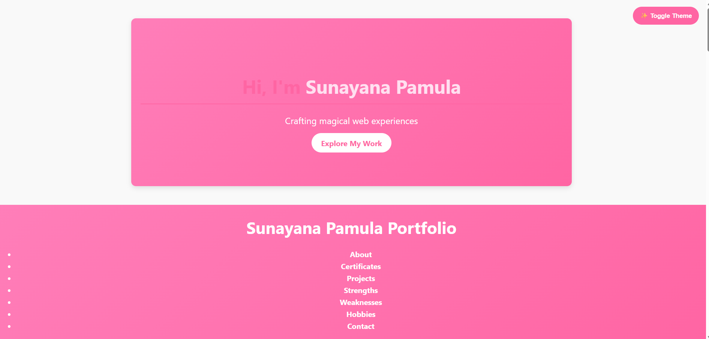
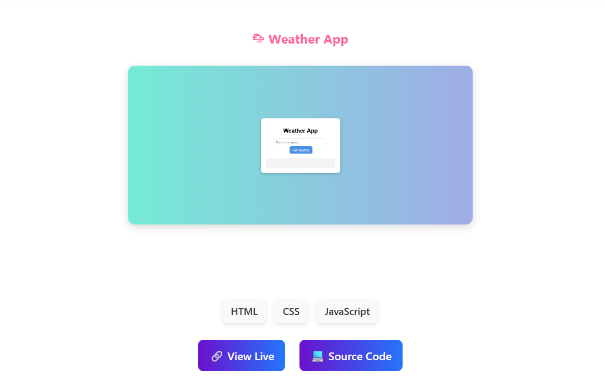

# 🌟 Portfolio Website

Welcome to my portfolio! This project showcases my skills, certificates, and live projects with a polished UI.

---
## 🧑‍💻 Skills

  
  
  

- **HTML5** – Semantic structure, forms, accessibility  
- **CSS3** – Responsive design, Flexbox, Grid, animations  
- **JavaScript** – DOM manipulation, ES6+, API integration

## 📜 Certificates
Here are some of my achievements:

-   
-   
- 

---

## 📸 Screenshots
Visual previews of my portfolio sections and projects:

### Portfolio Homepage

### Certificates Section

  
  
  

### Weather App

---

## 🛠️ Technologies Used

---

## 🚀 Features
- Responsive design for desktop and mobile  
- Certificates showcased with badges and PDF links  
- Screenshots for quick visual previews  
- Live demo links for recruiters  

---

## 📬 Contact
- **Email:** sunayanapamula@gmail.com  
- **LinkedIn:** [Sunayana Pamula](https://www.linkedin.com/in/sunayanapamula)  
- **GitHub:** [sunayanapamula-gif](https://github.com/sunayanapamula-gif)
