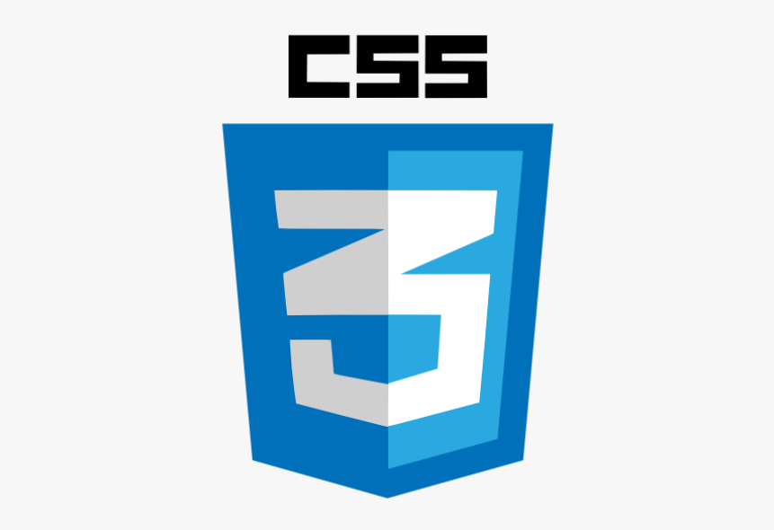

# 🌟 Portfolio Website

Welcome to my portfolio! This project showcases my skills, certificates, and live projects with a polished UI.

---

## 🧑‍💻 Skills

  
  
  

- **HTML5** – Semantic structure, forms, accessibility  
- **CSS3** – Responsive design, Flexbox, Grid, animations  
- **JavaScript** – DOM manipulation, ES6+, API integration  

---

## 📸 Screenshots

Visual previews of my portfolio sections and projects:

### Portfolio Homepage  

### Certificates Section  

### Weather App  

---

## 🛠️ Technologies Used

  
  
  

---

## 🚀 Features

- Responsive design for desktop and mobile  
- Certificates showcased with badges and PDF links  
- Screenshots for quick visual previews  
- Live demo links for recruiters  

---

## 📬 Contact

- **Email:** sunayanapamula@gmail.com  
- **LinkedIn:** [Sunayana Pamula](https://www.linkedin.com/in/sunayanapamula)  
- **GitHub:** [sunayanapamula-gif](https://github.com/sunayanapamula-gif)
